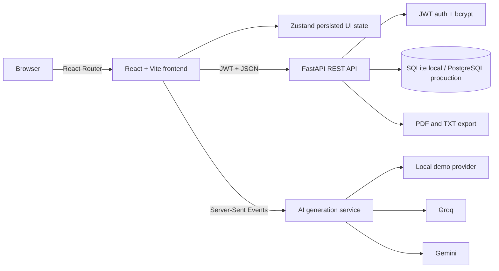

# ContentOS — AI-Powered Content Manager

ContentOS is a full-stack SaaS workspace for planning, creating, collaborating on, scheduling, and measuring content. It combines an AI rich-text editor, team workflows, a content calendar, analytics, templates, notifications, administration, and secure account management in one responsive application.

## Product screenshots

The interface is designed around three portfolio-ready product surfaces:

| Surface | What to capture |
|---|---|
| Marketing site | Hero, product preview, customer logos, features, testimonials, pricing, FAQ, and final CTA |
| AI workspace | Rich-text canvas, formatting toolbar, AI selection actions, autosave state, and document score |
| SaaS dashboard | Navigation, performance cards, activity chart, recent work, notification center, and dark mode |

Add release captures to `docs/screenshots/` as `landing.png`, `workspace.png`, and `dashboard.png` when preparing a public repository release.

## Features

| Area | Capabilities |
|---|---|
| AI Workspace | Rich-text editing, 30-second autosave, rewrite, summarize, grammar improvement, tone change, expand, shorten |
| Content generation | Blog, LinkedIn, Instagram, email, resume, SEO, and general-purpose AI workflows with SSE streaming |
| Collaboration | Shared workspace, invitations, roles, share links, comments, resolution state, and activity feed |
| Content calendar | Monthly calendar, post scheduling, channel/status metadata, upcoming posts, and monthly progress |
| Analytics | Performance, consistency, weekly productivity, content mix, most-used type, creation heatmap, and activity history |
| Templates | Category browsing, search, favorites, custom templates, and direct handoff to the AI workspace |
| Notifications | In-app notification center, unread state, success feedback, AI completion alerts, and preferences |
| Administration | Total users, content volume, active users, API health, growth charts, and content statistics |
| User settings | Profile updates, password changes, light/dark/system themes, and notification preferences |
| Content library | Search, filters, editing, favorites, archive, deletion, PDF/TXT export, and secure ownership |
| Marketing site | Hero, product preview, features, testimonials, pricing, FAQ, contact CTA, and responsive navigation |

## Architecture



```text
AI-Powered-Content-Manager/
├── backend/
│   ├── app/
│   │   ├── api/          # Auth, AI, content, analytics, exports
│   │   ├── core/         # Configuration and security
│   │   ├── db/           # SQLAlchemy engine and sessions
│   │   ├── models/       # User, content, activity
│   │   ├── schemas/      # Validated request and response models
│   │   └── services/     # AI provider abstraction
│   └── tests/            # API integration coverage
├── frontend/
│   └── src/
│       ├── components/   # Reusable feedback and UI primitives
│       ├── layouts/      # Authenticated SaaS shell
│       ├── pages/        # Product routes
│       ├── services/     # Typed API boundary
│       └── store/        # Auth, UI, and workspace state
├── render.yaml           # Backend infrastructure definition
└── vercel.json           # Frontend deployment configuration
```

## Tech stack

| Layer | Technology | Why it is used |
|---|---|---|
| Frontend | React 18, React Router, Vite | Component-driven UI, protected routing, and fast production builds |
| Styling | Tailwind CSS, Lucide icons | Responsive design system with consistent accessible controls |
| State | Zustand | Small, predictable persisted stores without unnecessary boilerplate |
| Data visualization | Recharts | Responsive productivity, distribution, and growth charts |
| API | FastAPI, Pydantic | Typed validation, automatic OpenAPI docs, and async streaming support |
| Persistence | SQLAlchemy, SQLite/PostgreSQL | Portable local development and production relational storage |
| Security | JWT, Passlib, bcrypt | Stateless protected APIs and one-way password hashing |
| AI | Groq, Gemini, local demo provider | Provider abstraction with a key-free portfolio fallback |
| Streaming | Server-Sent Events | Progressive AI output over a simple HTTP connection |
| Export | ReportLab | Server-generated PDF and plain-text downloads |
| Deployment | Render, Vercel | Managed API/database and globally distributed frontend hosting |

## Local development

### Prerequisites

- Node.js 20+
- Python 3.12+
- npm 10+

### Backend

```powershell
cd backend
python -m venv venv
venv\Scripts\activate
pip install -r requirements.txt
Copy-Item .env.example .env
uvicorn app.main:app --reload --port 8000
```

The default `AI_PROVIDER=demo` works without an API key. For a production provider:

```env
AI_PROVIDER=groq
GROQ_API_KEY=your-key
```

or:

```env
AI_PROVIDER=gemini
GEMINI_API_KEY=your-key
```

### Frontend

```powershell
cd frontend
npm install
Copy-Item .env.example .env
npm run dev
```

Open `http://localhost:5173`. `VITE_API_URL` must contain the backend origin without `/api`:

```env
VITE_API_URL=http://localhost:8000
```

## Environment variables

| Variable | Required | Default | Purpose |
|---|---:|---|---|
| `DATABASE_URL` | Production | `sqlite:///./content_manager.db` | SQLAlchemy connection string; use PostgreSQL on Render |
| `SECRET_KEY` | Yes | Development placeholder | Signs and verifies JWT access tokens |
| `ACCESS_TOKEN_EXPIRE_MINUTES` | No | `1440` | JWT lifetime in minutes |
| `FRONTEND_URL` | Yes in production | `http://localhost:5173` | Primary browser origin allowed by CORS |
| `CORS_ORIGINS` | No | Local Vite origins | Comma-separated additional trusted browser origins |
| `CORS_ORIGIN_REGEX` | No | Vercel preview regex | Optional trusted preview-origin pattern |
| `AI_PROVIDER` | No | `demo` | Selects `demo`, `groq`, or `gemini` |
| `GROQ_API_KEY` | For Groq | Empty | Groq provider credential |
| `GEMINI_API_KEY` | For Gemini | Empty | Gemini provider credential |
| `VITE_API_URL` | Yes for frontend | `http://localhost:8000` | Backend origin used by the React client |

## API documentation

Interactive OpenAPI documentation is available at `http://localhost:8000/docs` while the API runs.

| Method | Endpoint | Authentication | Purpose |
|---|---|---:|---|
| POST | `/api/auth/register` | No | Create an account and issue a JWT |
| POST | `/api/auth/login` | No | Authenticate and issue a JWT |
| GET | `/api/auth/profile` | Yes | Return the current user |
| PUT | `/api/auth/profile` | Yes | Update the current user's name |
| PUT | `/api/auth/password` | Yes | Verify and replace the current password |
| POST | `/api/ai/generate` | Yes | Generate a complete AI response |
| POST | `/api/ai/stream` | Yes | Stream generated text over SSE |
| GET | `/api/content` | Yes | Search, filter, and paginate owned content |
| POST | `/api/content` | Yes | Save content |
| GET | `/api/content/{id}` | Yes | Read owned content |
| PUT | `/api/content/{id}` | Yes | Update owned content |
| DELETE | `/api/content/{id}` | Yes | Delete owned content |
| GET | `/api/analytics/dashboard` | Yes | Return summaries, charts, and activity |
| POST | `/api/export/pdf` | Yes | Export content as PDF |
| POST | `/api/export/txt` | Yes | Export content as text |

Protected requests use:

```http
Authorization: Bearer <access_token>
Content-Type: application/json
```

Example generation request:

```json
{
  "content_type": "blog",
  "prompt": "Explain how small teams can build a repeatable content system",
  "tone": "professional",
  "length": "medium"
}
```

## Testing and production builds

```powershell
cd backend
pytest

cd ..\frontend
npm run build
npm run preview
```

The API tests use a separate temporary database and cover registration, authentication, content ownership, CRUD operations, generation, analytics, and exports.

## Deployment guide

### Backend on Render

1. Push the repository to GitHub.
2. Create a Render Blueprint from `render.yaml`.
3. Set `SECRET_KEY` to a cryptographically random value.
4. Set `FRONTEND_URL` to the final frontend origin.
5. Add `GROQ_API_KEY` or `GEMINI_API_KEY` and select `AI_PROVIDER` if required.
6. Deploy and verify `https://YOUR-API.onrender.com/health`.

Manual Render configuration:

| Setting | Value |
|---|---|
| Root directory | `backend` |
| Build command | `pip install -r requirements.txt` |
| Start command | `uvicorn app.main:app --host 0.0.0.0 --port $PORT` |
| Health check | `/health` |

### Frontend on Vercel

1. Import the repository into Vercel.
2. Keep the repository root; `vercel.json` targets the frontend workspace.
3. Set `VITE_API_URL=https://YOUR-API.onrender.com`.
4. Deploy, then update `FRONTEND_URL` on Render with the final Vercel origin.

## Publish to GitHub

```powershell
cd C:\Users\HP\Desktop\folders\codetech\AI-Powered-Content-Manager
git init
git add .
git commit -m "feat: build AI-powered content manager"
git branch -M main
git remote add origin https://github.com/aishwaryagangaraj-web/AI-Powered-Content-Manager.git
git push -u origin main
```

Before pushing, confirm `.env`, database, virtual-environment, dependency, and build-output files are excluded with `git status`.

## Resume-ready impact statements

- Built a full-stack AI content SaaS with React, FastAPI, SQLAlchemy, JWT authentication, streaming generation, analytics, and document exports.
- Designed authenticated content CRUD with strict per-user ownership, validated API contracts, searchable filters, favorites, archives, and activity history.
- Implemented provider-agnostic AI generation using Groq, Gemini, and a deterministic demo fallback with real-time Server-Sent Events.
- Created a responsive product experience spanning an AI editor, calendar, templates, collaboration, analytics, administration, and theme preferences.
- Prepared automated API tests, production builds, environment templates, and Render/Vercel deployment configuration.

Additional interview material is available in [`RESUME_POINTS.md`](RESUME_POINTS.md).

## Interview explanation

ContentOS demonstrates how to design a cohesive SaaS product rather than an isolated AI prompt screen. The React client owns interaction state and presentation, while FastAPI provides validation, authentication, content ownership, AI orchestration, analytics, and exports. SQLAlchemy keeps local SQLite development compatible with production PostgreSQL. AI output is streamed with SSE because generation is server-to-client and does not require the complexity of bidirectional WebSockets.

The most important engineering decisions are the provider abstraction, authenticated ownership checks, typed schemas, deterministic fallback mode, and separation between UI state and server-owned content. These make the application demonstrable without credentials while preserving a clear path to production providers.

## Production checklist

- Use PostgreSQL, HTTPS, a strong JWT secret, and restricted CORS origins.
- Put provider keys only in the deployment platform's encrypted environment store.
- Add Alembic migrations before evolving production database schemas.
- Add rate limiting, refresh-token rotation, structured logs, error monitoring, and background jobs for higher traffic.
- Review AI-generated content before publishing and document your organization's retention policy.
- Run `pytest` and `npm run build` in CI for every pull request.

## Future improvements

- Alembic-managed database migrations and seeded administrator roles
- Server-persisted shared workspaces, invitations, comments, templates, and scheduled publishing
- Refresh-token rotation, password reset, email verification, OAuth, and optional MFA
- Rate limiting, job queues, Redis caching, structured observability, and audit exports
- Direct publishing integrations for WordPress, LinkedIn, YouTube, and email platforms
- AI usage metering, subscriptions, billing, semantic search, and content version history
- Playwright end-to-end coverage, accessibility audits, and visual regression testing

## License

MIT
