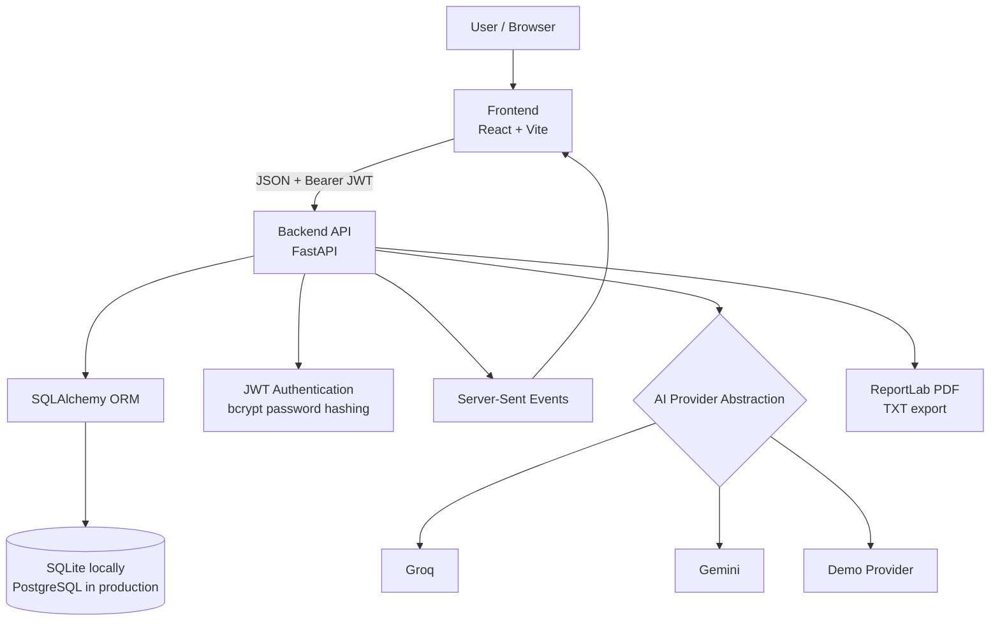
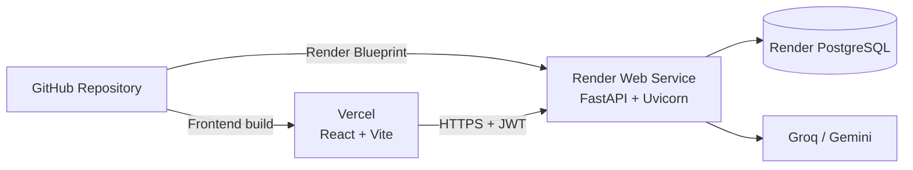

<div align="center">

# ContentOS

### AI-Powered Content Management SaaS

Plan, generate, refine, organize, schedule, and measure content from one secure, responsive workspace.

[](https://react.dev/)
[](https://vite.dev/)
[](https://tailwindcss.com/)
[](https://fastapi.tiangolo.com/)
[](https://www.python.org/)
[](https://www.postgresql.org/)

[](https://ai-powered-content-manager.vercel.app)
[](https://ai-powered-content-manager.onrender.com)
[](https://ai-powered-content-manager.onrender.com/docs)
[](https://github.com/aishwaryagangaraj-web/AI-Powered-Content-Manager/actions/workflows/ci.yml)

[Live Application](https://ai-powered-content-manager.vercel.app) · [API Documentation](https://ai-powered-content-manager.onrender.com/docs) · [Report an Issue](https://github.com/aishwaryagangaraj-web/AI-Powered-Content-Manager/issues)

</div>

---

## Overview

ContentOS is a full-stack portfolio-grade SaaS application for modern content workflows. It combines provider-agnostic AI generation, a rich editing workspace, secure content ownership, streaming responses, reusable templates, scheduling, analytics, notifications, collaboration surfaces, and document exports.

The project is designed to demonstrate more than a basic AI prompt interface. It shows how a production-oriented React client, typed FastAPI service, relational data layer, authentication system, AI provider abstraction, and cloud deployment pipeline fit together as one cohesive product.

## Live demo

| Service | URL | Purpose |
|---|---|---|
| Frontend | [ai-powered-content-manager.vercel.app](https://ai-powered-content-manager.vercel.app) | Public React application hosted on Vercel |
| Backend API | [ai-powered-content-manager.onrender.com](https://ai-powered-content-manager.onrender.com) | FastAPI service hosted on Render |
| Interactive API docs | [ai-powered-content-manager.onrender.com/docs](https://ai-powered-content-manager.onrender.com/docs) | Swagger/OpenAPI endpoint explorer |
| Health check | [ai-powered-content-manager.onrender.com/health](https://ai-powered-content-manager.onrender.com/health) | Backend availability and version status |

> Render free-tier services may need a short warm-up period after inactivity.

## Project highlights

- **AI Content Generation** — Generate blogs, LinkedIn posts, Instagram captions, professional emails, resume summaries, SEO articles, product descriptions, and YouTube descriptions.
- **Real-time Streaming Responses** — Stream AI output progressively with Server-Sent Events instead of waiting for a complete response.
- **JWT Authentication** — Register, sign in, update profiles, change passwords, and protect user-owned API resources.
- **Analytics Dashboard** — Track output volume, total words, favorites, archives, productivity, content mix, and recent activity.
- **Content Calendar** — Plan publishing dates, channels, statuses, upcoming posts, and monthly progress.
- **Template Management** — Browse categories, search templates, save favorites, and create reusable custom workflows.
- **PDF/TXT Export** — Export owned content through authenticated server-generated downloads.
- **Dark/Light Theme** — Persist light, dark, or system appearance preferences.
- **Responsive Design** — Use the full SaaS workspace across desktop, tablet, and mobile layouts.
- **Production Deployment** — Deploy the frontend to Vercel and the API/database stack to Render.

## Screenshots

Screenshots can be added to the following repository paths without changing this README:

| Landing page | Dashboard |
|---|---|
|  |  |

| AI workspace | Analytics |
|---|---|
|  |  |

> Recommended capture size: 1440 × 900 pixels. Keep account details and API credentials out of screenshots.

## Features

| Area | Capabilities |
|---|---|
| ✨ **AI Workspace** | Rich-text editing, 30-second local autosave, rewrite, summarize, grammar improvement, tone change, expansion, and shortening |
| ⚡ **AI Generator** | Eight focused formats, selectable tone and length, progressive SSE output, editing, copy, and save actions |
| 📚 **Content Library** | Search, type filtering, editing, favorites, archives, deletion, PDF export, TXT export, and secure ownership |
| 👥 **Collaboration** | Shared workspace interface, member invitations, roles, share links, comments, resolution states, and activity feed |
| 📅 **Content Calendar** | Monthly calendar, scheduling form, channel and workflow status, upcoming posts, and monthly performance |
| 📊 **Advanced Analytics** | Performance score, consistency score, productivity score, weekly chart, content distribution, heatmap, and activity history |
| 🧩 **Template Marketplace** | Category browsing, search, favorites, custom templates, and direct AI Workspace handoff |
| 🔔 **Notifications** | Unread state, success messages, AI completion alerts, notification center, and preferences |
| 🛡️ **Administration** | User, content, activity, uptime, growth, and content-type overview surfaces |
| ⚙️ **Settings** | Profile update, password change, theme settings, and notification preferences |
| 🌐 **Marketing Site** | Hero, product preview, feature cards, customer testimonials, pricing, FAQ, contact CTA, and responsive navigation |
| 🧪 **Quality and Delivery** | Pytest integration suite, OpenAPI documentation, GitHub Actions CI, environment templates, and deployment manifests |

## Architecture



### Request flow

1. The React client authenticates against FastAPI and stores the issued access token in its persisted authentication store.
2. Axios and streaming fetch requests attach `Authorization: Bearer <token>` to protected calls.
3. FastAPI dependencies decode the JWT, load the user, and enforce user ownership before accessing content.
4. Pydantic validates request and response contracts at the API boundary.
5. SQLAlchemy persists users, content, and activity to SQLite locally or PostgreSQL in production.
6. The AI service selects Groq, Gemini, or the deterministic demo provider from environment configuration.
7. Streaming generation is returned as SSE events, while exports are returned as downloadable PDF or text responses.

## Detailed tech stack

| Technology | Layer | Responsibility |
|---|---|---|
| React 18 | Frontend | Component-driven application and interactive product surfaces |
| Vite 6 | Frontend tooling | Development server, dependency handling, optimized production builds, and previews |
| Tailwind CSS 3 | Design system | Responsive layouts, themes, states, transitions, and reusable visual primitives |
| Zustand | Client state | Persisted authentication, theme, notification, workspace, calendar, and template state |
| Recharts | Visualization | Responsive activity, distribution, productivity, and growth charts |
| Axios / Fetch | Networking | JSON API calls and progressive streaming requests |
| FastAPI | Backend | Typed REST APIs, dependency injection, authentication, streaming, and OpenAPI docs |
| SQLAlchemy 2 | Data layer | ORM models, queries, sessions, ownership filters, and database portability |
| Pydantic 2 | Validation | Environment settings and typed request/response validation |
| JWT / OAuth2 bearer | Security | Stateless access-token authentication for protected APIs |
| Passlib / bcrypt | Security | One-way password hashing and verification |
| SQLite | Local database | Zero-configuration development and test persistence |
| PostgreSQL | Production database | Concurrent relational persistence managed through Render |
| Groq | AI provider | Low-latency production text generation option |
| Gemini | AI provider | Google-hosted production generation option |
| Demo provider | AI fallback | Deterministic, key-free local and portfolio demonstration mode |
| Server-Sent Events | Streaming | One-directional progressive AI output over standard HTTP |
| ReportLab | Export | Server-side PDF generation |
| Pytest | Testing | FastAPI integration tests for authentication, CRUD, AI, analytics, and exports |
| Render | Backend hosting | FastAPI service, health checks, environment variables, and PostgreSQL |
| Vercel | Frontend hosting | Vite build, SPA routing, global frontend delivery, and preview deployments |
| GitHub Actions | CI | Automated Python tests and frontend production builds |

## Database schema

### User

Represents an authenticated account and owns content and activity records.

| Field | Type | Notes |
|---|---|---|
| `id` | Integer | Primary key |
| `name` | String | Display name, maximum 100 characters |
| `email` | String | Unique, indexed, normalized email address |
| `hashed_password` | String | bcrypt hash; plain-text passwords are never stored |
| `created_at` | DateTime | UTC account creation timestamp |

Relationships: one user has many content records and many activity records. Both relationships use delete-orphan cascading.

### Content

Stores generated or edited content and its organization state.

| Field | Type | Notes |
|---|---|---|
| `id` | Integer | Primary key |
| `user_id` | Integer | Indexed foreign key to `users.id` |
| `title` | String | User-facing title, maximum 200 characters |
| `content_type` | String | Blog, LinkedIn, Instagram, email, resume, SEO, product, YouTube, or general |
| `prompt` | Text | Original generation request |
| `generated_text` | Text | Generated and user-edited content |
| `is_favorite` | Boolean | Favorite-library state |
| `is_archived` | Boolean | Archive-library state |
| `created_at` | DateTime | UTC creation timestamp |
| `updated_at` | DateTime | UTC timestamp updated automatically on changes |

Every content query is filtered by the authenticated user's ID before returning or mutating data.

### Activity

Records meaningful account and content events for dashboards and analytics.

| Field | Type | Notes |
|---|---|---|
| `id` | Integer | Primary key |
| `user_id` | Integer | Indexed foreign key to `users.id` |
| `action` | String | Human-readable action description |
| `timestamp` | DateTime | Indexed UTC event time |

## Folder structure

```text
AI-Powered-Content-Manager/
├── .github/
│   └── workflows/ci.yml       # Backend and frontend CI
├── backend/
│   ├── app/
│   │   ├── api/               # Auth, AI, content, analytics, and export routes
│   │   ├── core/              # Settings and JWT/password security
│   │   ├── db/                # SQLAlchemy engine, base, and sessions
│   │   ├── models/            # User, Content, and Activity tables
│   │   ├── schemas/           # Pydantic API contracts
│   │   ├── services/          # Groq, Gemini, and demo AI abstraction
│   │   ├── utils/             # Activity logging
│   │   └── main.py            # FastAPI application and CORS
│   ├── tests/                 # API integration tests
│   ├── .env.example
│   ├── requirements.txt
│   └── runtime.txt
├── frontend/
│   ├── src/
│   │   ├── components/        # Feedback, boundaries, branding, and route guards
│   │   ├── hooks/             # Theme behavior
│   │   ├── layouts/           # Authenticated SaaS shell
│   │   ├── pages/             # Marketing and product routes
│   │   ├── services/          # API client and error normalization
│   │   ├── store/             # Auth, UI, and SaaS state
│   │   └── utils/             # Formatting helpers
│   ├── .env.example
│   └── package.json
├── LINKEDIN_POST.md
├── RESUME_POINTS.md
├── render.yaml
├── vercel.json
└── README.md
```

## Local development

### Prerequisites

- Node.js 20+
- npm 10+
- Python 3.12+
- Git

### Backend setup

```powershell
cd C:\Users\HP\Desktop\folders\codetech\AI-Powered-Content-Manager\backend
python -m venv venv
venv\Scripts\activate
python -m pip install --upgrade pip
pip install -r requirements.txt
Copy-Item .env.example .env
uvicorn app.main:app --reload --port 8000
```

If port 8000 is occupied:

```powershell
uvicorn app.main:app --reload --port 8010
```

Local backend URLs:

- API root: `http://localhost:8000`
- Health check: `http://localhost:8000/health`
- OpenAPI documentation: `http://localhost:8000/docs`

The default `AI_PROVIDER=demo` requires no API key. To use Groq:

```env
AI_PROVIDER=groq
GROQ_API_KEY=your-key
```

To use Gemini:

```env
AI_PROVIDER=gemini
GEMINI_API_KEY=your-key
```

### Frontend setup

Open a second terminal:

```powershell
cd C:\Users\HP\Desktop\folders\codetech\AI-Powered-Content-Manager\frontend
npm install
Copy-Item .env.example .env
npm run dev
```

Open `http://localhost:5173`.

`VITE_API_URL` is the backend origin only. The frontend appends `/api` internally:

```env
VITE_API_URL=http://localhost:8000
```

## Environment variables

### Backend

| Variable | Required | Default | Purpose |
|---|---:|---|---|
| `DATABASE_URL` | Production | `sqlite:///./content_manager.db` | SQLAlchemy database connection; use PostgreSQL on Render |
| `SECRET_KEY` | Yes | Development placeholder | Signs and verifies JWT access tokens |
| `ACCESS_TOKEN_EXPIRE_MINUTES` | No | `1440` | Access-token lifetime in minutes |
| `FRONTEND_URL` | Production | `http://localhost:5173` | Primary trusted frontend origin |
| `CORS_ORIGINS` | No | Local Vite origins | Comma-separated exact origins trusted by CORS |
| `CORS_ORIGIN_REGEX` | No | Vercel preview pattern | Optional pattern for trusted preview deployments |
| `AI_PROVIDER` | No | `demo` | Selects `demo`, `groq`, or `gemini` |
| `GROQ_API_KEY` | For Groq | Empty | Groq API credential |
| `GEMINI_API_KEY` | For Gemini | Empty | Gemini API credential |

### Frontend

| Variable | Required | Default | Purpose |
|---|---:|---|---|
| `VITE_API_URL` | Production | `http://localhost:8000` | Backend origin without a trailing `/api` |

Never commit `.env` files or provider credentials. The included `.gitignore` excludes environments, databases, dependencies, build output, and local secrets.

## API endpoints

Interactive documentation is available locally at `http://localhost:8000/docs` and in production at [the live Swagger UI](https://ai-powered-content-manager.onrender.com/docs).

### Authentication

| Method | Endpoint | Auth | Description |
|---|---|---:|---|
| `POST` | `/api/auth/register` | No | Create an account and issue a JWT |
| `POST` | `/api/auth/login` | No | Verify credentials and issue a JWT |
| `GET` | `/api/auth/profile` | Yes | Return the authenticated user |
| `PUT` | `/api/auth/profile` | Yes | Update the authenticated user's name |
| `PUT` | `/api/auth/password` | Yes | Verify and replace the current password |

### AI generation

| Method | Endpoint | Auth | Description |
|---|---|---:|---|
| `POST` | `/api/ai/generate` | Yes | Return a complete generated response |
| `POST` | `/api/ai/stream` | Yes | Stream generation as SSE events |

### Content management

| Method | Endpoint | Auth | Description |
|---|---|---:|---|
| `GET` | `/api/content` | Yes | Search, filter, and paginate owned content |
| `POST` | `/api/content` | Yes | Save a new content record |
| `GET` | `/api/content/{id}` | Yes | Read an owned content record |
| `PUT` | `/api/content/{id}` | Yes | Update content, favorite, or archive state |
| `DELETE` | `/api/content/{id}` | Yes | Permanently delete owned content |

### Analytics and exports

| Method | Endpoint | Auth | Description |
|---|---|---:|---|
| `GET` | `/api/analytics/dashboard` | Yes | Return summary metrics, charts, content mix, and activity |
| `POST` | `/api/export/pdf` | Yes | Generate and download a PDF document |
| `POST` | `/api/export/txt` | Yes | Generate and download a text document |

Protected requests use:

```http
Authorization: Bearer <access_token>
Content-Type: application/json
```

Example AI request:

```json
{
  "content_type": "blog",
  "prompt": "Explain how small teams can build a repeatable content system",
  "tone": "professional",
  "length": "medium"
}
```

Example SSE events:

```text
data: {"chunk":"Great content "}

data: {"chunk":"starts with clarity."}

data: {"done":true}
```

## Testing and production builds

### Backend tests

```powershell
cd backend
venv\Scripts\activate
pytest
```

The suite uses a separate test database and covers registration, login, profile updates, password changes, authentication protection, content ownership, CRUD, filtering, AI generation, extended content types, SSE, analytics, PDF export, TXT export, and CORS.

### Frontend build

```powershell
cd frontend
npm run build
npm run preview
```

GitHub Actions runs both checks on pushes and pull requests through `.github/workflows/ci.yml`.

## Deployment architecture



### Frontend on Vercel

The production frontend is hosted at [ai-powered-content-manager.vercel.app](https://ai-powered-content-manager.vercel.app).

1. Import the GitHub repository into Vercel.
2. Keep the repository root; `vercel.json` runs installation and builds inside `frontend/`.
3. Configure `VITE_API_URL=https://ai-powered-content-manager.onrender.com`.
4. Deploy. SPA rewrites route client-side URLs back to `index.html`.

### Backend and PostgreSQL on Render

The production API is hosted at [ai-powered-content-manager.onrender.com](https://ai-powered-content-manager.onrender.com).

1. Push the repository to GitHub.
2. In Render, create a **Blueprint** from `render.yaml`.
3. Render builds the `backend/` service and provisions PostgreSQL.
4. Set `FRONTEND_URL=https://ai-powered-content-manager.vercel.app`.
5. Set `CORS_ORIGINS=https://ai-powered-content-manager.vercel.app`.
6. Keep `AI_PROVIDER=demo`, or configure Groq/Gemini credentials.
7. Verify `/health` and `/docs` after deployment.

Manual Render settings:

| Setting | Value |
|---|---|
| Root directory | `backend` |
| Runtime | Python 3.12 |
| Build command | `pip install -r requirements.txt` |
| Start command | `uvicorn app.main:app --host 0.0.0.0 --port $PORT` |
| Health check | `/health` |

### CORS configuration

FastAPI accepts exact local and production origins from `FRONTEND_URL` and `CORS_ORIGINS`. `CORS_ORIGIN_REGEX` optionally supports trusted Vercel preview deployments. Do not use a wildcard origin with credentialed production requests.

### Production workflow

1. Push a reviewed change to GitHub.
2. GitHub Actions runs backend tests and the frontend build.
3. Vercel builds and publishes the React application.
4. Render builds and restarts the FastAPI service.
5. The frontend calls Render over HTTPS using `VITE_API_URL`.
6. Render reads encrypted environment variables and persists relational data to PostgreSQL.

## Publish to GitHub

```powershell
cd C:\Users\HP\Desktop\folders\codetech\AI-Powered-Content-Manager
git init
git add .
git commit -m "feat: build AI-powered content manager"
git branch -M main
git remote add origin https://github.com/aishwaryagangaraj-web/AI-Powered-Content-Manager.git
git push -u origin main
```

Before pushing, run `git status` and confirm `.env`, databases, virtual environments, `node_modules`, and build output are excluded.

## Resume value

Recruiters and interviewers can evaluate the following skills through this repository:

- **Full-stack architecture:** Separation between product UI, REST APIs, validation, persistence, AI orchestration, exports, and deployment.
- **Frontend engineering:** Protected routing, responsive layouts, component composition, persisted state, rich interactions, accessibility states, charts, themes, and error handling.
- **Backend engineering:** FastAPI dependencies, typed schemas, modular routes, SQLAlchemy sessions, relational models, ownership filters, and streaming responses.
- **Security fundamentals:** JWT expiry, bearer-token protection, bcrypt password hashing, CORS allowlists, secret management, and per-user resource isolation.
- **AI product engineering:** Multiple provider integrations, deterministic fallback behavior, prompt construction, streaming UX, failure handling, and content review boundaries.
- **Database design:** User-to-content and user-to-activity relationships, indexed fields, cascade behavior, SQLite development, and PostgreSQL production deployment.
- **Quality practices:** Integration testing, build verification, environment examples, error normalization, CI, documentation, and production checklists.
- **Cloud deployment:** Independent frontend/backend hosting, environment coordination, SPA routing, health checks, database provisioning, and HTTPS API integration.

Resume-ready bullet points and a longer project explanation are available in [`RESUME_POINTS.md`](RESUME_POINTS.md).

## Interview explanation

ContentOS demonstrates how to design a cohesive SaaS product rather than an isolated model call. React owns interactive presentation and short-lived client state. FastAPI provides validation, authentication, ownership enforcement, AI orchestration, analytics, and document exports. SQLAlchemy keeps local SQLite development compatible with production PostgreSQL. SSE is used because AI output is a one-directional server-to-client stream and does not require the operational complexity of bidirectional WebSockets.

The key engineering decisions are provider abstraction, typed API contracts, deterministic fallback mode, authenticated ownership checks, progressive feedback, and separation between client-owned interface state and server-owned content.

## Interview questions and answers

<details>
<summary><strong>1. Why did you choose FastAPI for the backend?</strong></summary>

FastAPI provides Pydantic validation, dependency injection, automatic OpenAPI documentation, async request support, and clean streaming responses. These features reduce boilerplate and fit an authenticated AI API well.
</details>

<details>
<summary><strong>2. How does JWT authentication work in this project?</strong></summary>

Registration or login returns a signed access token containing the user ID in the `sub` claim and an expiry. Protected routes use an OAuth2 bearer dependency to decode the token, load the user, and reject invalid, expired, or unknown accounts.
</details>

<details>
<summary><strong>3. Why are passwords hashed with bcrypt?</strong></summary>

bcrypt is deliberately slow and salted, which makes offline password guessing more expensive. The application stores only the resulting hash and verifies submitted passwords through Passlib; it never stores or returns plain-text passwords.
</details>

<details>
<summary><strong>4. How is content ownership enforced?</strong></summary>

The authenticated user is resolved before protected operations. Content queries include both the requested content ID and `Content.user_id == current_user.id`, so another user's record is treated as unavailable instead of being exposed.
</details>

<details>
<summary><strong>5. What role does Pydantic play?</strong></summary>

Pydantic validates request length, email structure, content types, tones, and response shapes. It also loads typed environment settings, reducing invalid state at the API boundary and improving generated OpenAPI documentation.
</details>

<details>
<summary><strong>6. Why use SQLAlchemy instead of writing raw SQL?</strong></summary>

SQLAlchemy provides portable models, relationships, sessions, composable queries, and database-independent code. It lets the same application use SQLite locally and PostgreSQL in production while still supporting explicit ownership filters and aggregations.
</details>

<details>
<summary><strong>7. How are database sessions managed?</strong></summary>

A FastAPI dependency creates a SQLAlchemy session for each request and closes it in a `finally` block. Mutating endpoints explicitly flush or commit, then refresh records when the response requires generated database values.
</details>

<details>
<summary><strong>8. Why support SQLite and PostgreSQL?</strong></summary>

SQLite provides zero-configuration development and isolated tests. PostgreSQL provides stronger concurrency, managed production persistence, indexing, and relational guarantees. SQLAlchemy keeps the application layer consistent across both.
</details>

<details>
<summary><strong>9. Why use Server-Sent Events for AI streaming?</strong></summary>

Generation is primarily a one-directional stream from the server to the browser. SSE uses normal HTTP, is simple to parse, works well through common proxies, and avoids the added complexity of WebSockets when bidirectional messaging is unnecessary.
</details>

<details>
<summary><strong>10. How does the frontend consume SSE?</strong></summary>

The generator uses `fetch`, reads the response body's stream with a `ReadableStream` reader, decodes chunks, separates SSE events, parses each JSON payload, and appends text to React state as it arrives.
</details>

<details>
<summary><strong>11. How are multiple AI providers supported?</strong></summary>

The AI service owns provider selection and shared prompt construction. It checks `AI_PROVIDER` and credentials, calls Groq or Gemini when configured, and otherwise uses a deterministic demo provider. Routes therefore remain independent of provider-specific details.
</details>

<details>
<summary><strong>12. Why include a demo AI provider?</strong></summary>

It makes local setup, automated testing, recruiter review, and portfolio demonstrations work without paid credentials or external availability. It also provides a predictable fallback and exercises the same API and streaming paths as real providers.
</details>

<details>
<summary><strong>13. How is frontend authentication state handled?</strong></summary>

Zustand persists the token and user. A protected route checks authentication before rendering application routes, and the Axios response interceptor clears stale authentication after a `401`, causing the router to return the user to sign-in.
</details>

<details>
<summary><strong>14. Why use Zustand?</strong></summary>

The application needs small persisted stores for authentication, theme, notifications, and workspace UI state. Zustand provides direct actions and selective subscriptions without the ceremony of a larger global-state framework.
</details>

<details>
<summary><strong>15. How does the rich-text AI workspace work?</strong></summary>

The editor uses a content-editable surface, captures the active browser selection, sends selected text with a transformation instruction to the AI endpoint, replaces the selected range with the result, and persists the draft locally every 30 seconds.
</details>

<details>
<summary><strong>16. How are analytics calculated?</strong></summary>

The backend uses SQLAlchemy count and group-by queries for content totals, favorites, archives, content types, and daily creation. Word totals are derived from owned generated text, and recent activity is ordered and limited for dashboard use.
</details>

<details>
<summary><strong>17. How do PDF and TXT exports work?</strong></summary>

Authenticated export endpoints validate the title and body. TXT returns a formatted text response. PDF uses ReportLab to wrap lines, paginate content, set metadata, and return an attachment with a sanitized filename.
</details>

<details>
<summary><strong>18. How is CORS configured for local and production environments?</strong></summary>

FastAPI builds an allowlist from local origins, `FRONTEND_URL`, and comma-separated `CORS_ORIGINS`. An optional regex supports trusted Vercel previews. Credentials are enabled only with explicit trusted origins rather than a production wildcard.
</details>

<details>
<summary><strong>19. How is the application deployed?</strong></summary>

Vercel installs and builds the Vite frontend and rewrites SPA routes to `index.html`. Render builds the FastAPI backend, starts Uvicorn on the platform-provided port, performs `/health` checks, injects secrets, and provides the PostgreSQL connection string.
</details>

<details>
<summary><strong>20. What would you improve before scaling the product?</strong></summary>

I would add Alembic migrations, refresh-token rotation, email verification, server-backed multi-tenant workspaces, Redis caching, Celery workers, rate limiting, usage metering, observability, billing, and browser-level end-to-end tests.
</details>

## Production checklist

- Use PostgreSQL, HTTPS, a cryptographically strong JWT secret, and restricted CORS origins.
- Keep provider keys and secrets in encrypted deployment environment stores.
- Add Alembic migrations before changing production database schemas.
- Add refresh-token rotation, rate limiting, structured logs, monitoring, and background jobs for higher traffic.
- Review AI-generated content before publishing and define an organizational retention policy.
- Run `pytest` and `npm run build` through CI for every pull request.
- Verify `/health`, `/docs`, authentication, generation, CRUD, analytics, and exports after deployment.

## Future enhancements

- **OAuth Login** — Google, GitHub, and Microsoft identity providers
- **Redis Cache** — Cached analytics, sessions, rate limits, and frequently accessed templates
- **Celery Background Jobs** — Long AI jobs, exports, publishing, and notification workflows
- **Email Notifications** — Invitations, mentions, password recovery, AI completion, and scheduled reports
- **Content Scheduling** — Server-persisted schedules and publishing integrations
- **Multi-Tenant Workspaces** — Organizations, roles, invitations, resource isolation, and audit logs
- **Stripe Billing** — Subscriptions, plans, trials, invoices, and usage-based limits
- **AI Usage Tracking** — Tokens, provider cost, quotas, latency, and organization-level reports
- Alembic database migrations and seedable administrator roles
- Refresh tokens, email verification, password recovery, MFA, and security audit history
- Semantic search, content version history, brand voice profiles, and plagiarism checks
- WordPress, LinkedIn, YouTube, and email-platform publishing integrations
- Playwright end-to-end tests, accessibility automation, visual regression testing, and observability

## Contributing

Contributions, bug reports, and focused feature proposals are welcome.

1. Fork the repository.
2. Create a branch from `main`:

   ```bash
   git checkout -b feat/short-description
   ```

3. Install both application workspaces and create local `.env` files from the examples.
4. Keep changes focused and preserve authenticated ownership checks.
5. Add or update tests for backend behavior.
6. Run the verification commands:

   ```powershell
   cd backend
   pytest

   cd ..\frontend
   npm run build
   ```

7. Commit using a clear conventional message:

   ```bash
   git commit -m "feat: add concise feature description"
   ```

8. Push the branch and open a pull request describing the problem, solution, validation, and screenshots where relevant.

Please do not commit `.env` files, API keys, databases, generated exports, virtual environments, dependency folders, or build output.

## License

This project is intended for release under the MIT License. You may use, modify, and distribute it with the required copyright and license notice.

If a `LICENSE` file has not yet been added to your fork, create one before distributing the project publicly.

---

<div align="center">

Built to demonstrate full-stack engineering, secure API design, AI integration, streaming UX, relational data modeling, testing, and production deployment.

[Live Demo](https://ai-powered-content-manager.vercel.app) · [API Docs](https://ai-powered-content-manager.onrender.com/docs) · [Resume Notes](RESUME_POINTS.md) · [LinkedIn Post](LINKEDIN_POST.md)

</div>
